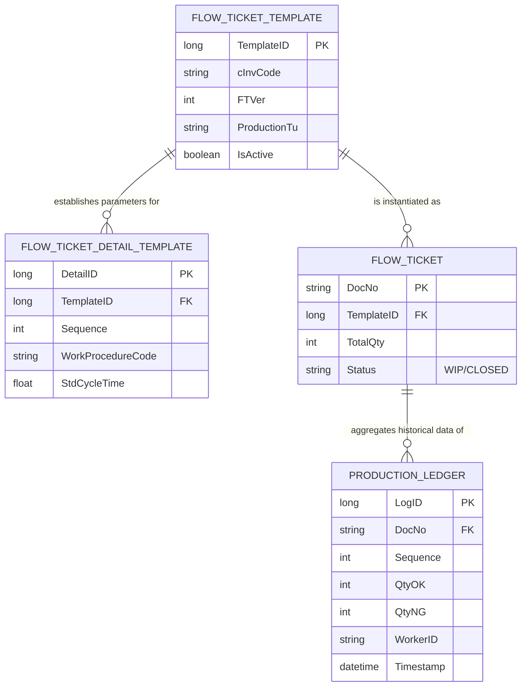

### Manufacturing Execution System (MES), IPE Thailand: Document of System Architecture (Version 1.4)

Project Designation: Manufacturing Execution System Migration (China Jurisdiction to Thailand Jurisdiction)

Authorship: Lead Architectural Authority

Date of Inception: February 2026

Status Designation: Authorized for Initial Deployment Phase (Evaluative Execution)

1. Executive Summary and Strategic Vision

The undertaking concerning the Manufacturing Execution System (MES) within the IPE Thailand jurisdiction constitutes a strategic infrastructural migration. Said migration mandates the transition of the operational framework from a legacy, monolithic Windows Presentation Foundation (WPF) application—heretofore utilized exclusively within the China-based manufacturing facility—toward a modernized, cloud-native web and mobile architectural paradigm.

Core Objectives:

Dematerialization of Shop Floor Documentation: The eradication of physical transfer documentation shall be achieved through the implementation of digital cryptographic handshakes executed upon mobile terminal devices (Personal Digital Assistants or PDAs).

Instantaneous Operational Visibility: The antecedent paradigm of diurnal, manual Work-In-Progress (WIP) reporting shall be superseded by instantaneous, bottleneck-oriented KanBan visual management interfaces.

High-Fidelity Tracking Mechanisms: The facilitation of high-frequency Computer Numerical Control (CNC) operational tracking shall be supported through the utilization of an optimized, append-only transactional data ledger.

Bifurcated Production Workflows: Native systemic support shall be provided for both "One-piece flow" (applicable to Request for Quotation processes and sample generation) and "Ticket-batch flow" (applicable to standard mass production methodologies).

2. Technical Stack and Infrastructural Specifications

A "Modular Monolith" architectural methodology has been adopted to guarantee expedited performance metrics concerning shop floor transactional processing, whilst concurrently maintaining the strict isolation of computationally intensive workloads (e.g., the Simulated Annealing scheduling algorithm).

| Architectural Layer | Designated Technology | Strategic Rationale |
|---|---|---|
| Client Interface (Manufacturing Floor Devices) | Vue.js 3 + Vite | The deployment of a lightweight, responsive design is necessitated to optimize barcode scanning and tactile interface interactions. |
| Client Interface (Administrative Dashboards) | Vue.js 3 + Tailwind CSS | The provision of a comprehensive user interface is required for Production Material Control (PMC), Quality Assurance (QA), and engineering routing configurations. |
| Application Programming Interface (Backend) | Java 21 + Spring Boot 3 | A robust, multi-threaded environment is imperative to sustain Advanced Planning and Scheduling (APS) operations alongside concurrent procedural requests. |
| Data Persistence Layer | MariaDB / MS SQL Server | Relational integrity must be maintained for complex production routings, ensuring simultaneous backward compatibility with antecedent data structures. |
| Real-Time Messaging Protocol | WebSockets (STOMP) | Machine status and KanBan updates shall be transmitted to mobile devices instantaneously, thereby precluding the latency associated with server-polling methodologies. |

3. Core Data Architecture: The Transactional Ledger Paradigm

An architectural upgrade has been enacted, transitioning the system from the antecedent "Template Cloning" methodology to an Append-Only Transaction Ledger configuration. This structural modification is engineered to preclude database locking anomalies, furnish an immutable historical auditing ledger, and substantially augment overarching system throughput. Furthermore, legacy composite keys have been systematically extirpated to optimize the functional efficacy of modern Object-Relational Mapping (ORM) frameworks, specifically within the Spring Boot/Hibernate environments.

3.1 Entity Relationship Diagram

3.2 Master Data versus Execution Data

The Immutable Blueprint: The FLOW_TICKET_DETAIL_TEMPLATE table serves to define the immutable production plan. Engineering personnel are required to execute version control procedures within the FLOW_TICKET_TEMPLATE table. Through the introduction of a surrogate primary key (TemplateID), the legacy cInvCode + FTVer composite key has been eliminated, thereby ensuring a structurally sound, single-column Foreign Key relationship for all appurtenant child records.

The Append-Only Ledger: The PRODUCTION_LEDGER table is utilized to capture verifiable, empirical events. Upon the submission of a progress report by operational personnel, a novel row is subsequently inserted into the database.

4. Business Logic and Execution Workflows

4.1 Dynamic Sequence Calculation (Hydrodynamic Flow Logic)

The determination of the subsequent actionable procedural sequence is calculated dynamically by the system in real-time.

Availability Mathematics: The available processing quantity (Available_Qty) is derived by subtracting the total processed quantity within the current sequence from the aggregate of successfully processed units emanating from the antecedent sequence.

4.2 Partial Batch Configuration Parameters

The permissibility of processing partial batches is governed by a global application configuration parameter, designated as mes.production.allow-partial-batch.

In the event of a false designation (Standard Enterprise Regulation): A designated sequence shall remain inaccessible (Available_Qty = 0) until the entirety of the anticipated quantity from the preceding sequence has been formally registered within the ledger.

In the event of a true designation (Override Mechanism): Manufactured components shall be permitted to proceed immediately to the subsequent sequence upon the formal registration of their completion.

4.3 Dematerialized Transfer Handshake Protocol

Submission Phase: An operational entity stationed at the primary machining apparatus concludes the processing of a specified quantity and subsequently submits said quantitative data via a mobile terminal device.

Acceptance Phase: A subsequent operational entity situated at the secondary machining apparatus utilizes a scanning mechanism to read the cryptographic identifier (QR code) associated with the documentation. The mobile device subsequently displays the available quantity. Receipt is formally confirmed by the secondary entity, thereby initiating the subsequent operational cycle.

4.4 Print-Time Data Resolution and Template Engines

Active manufacturing tickets are not provisioned with pre-allocated detail rows. In instances where the physical generation of a traveler document containing routing specifications is necessitated prior to the commencement of production, the printing service is programmed to execute a Plan-versus-Actual join operation. This operation extracts the TemplateID from the FLOW_TICKET table and instantaneously retrieves the sequentially ordered procedures from the FLOW_TICKET_DETAIL_TEMPLATE table.

Printing Technology Strategy:

Primary Methodology (Cascading Style Sheets Web Printing): The frontend architecture generates standard HyperText Markup Language (HTML). Specific CSS media queries (@media print) are utilized to excise navigational elements and format the pertinent data strictly for A4 paper or label printing apparatuses. Primary advantages: Expedited processing speeds; server-side rendering is rendered unnecessary.

Contingency Methodology (JasperReports): Should the manipulation of CSS prove excessively burdensome for the maintenance of complex formatting requirements, the implementation of JasperReports shall be executed.

Operational Methodology: Print templates are designed visually utilizing "JasperSoft Studio." The resultant .jrxml template file is stored upon the server infrastructure. Upon the initiation of a print request, the backend infrastructure injects the relevant data into the template, thereby generating a strictly formatted Portable Document Format (PDF) file for subsequent download and physical printing.

5. Sub-Module Integrations

5.1 Advanced Planning and Scheduling (APS) and Material Requirements Planning (MRP)

Advanced Planning and Scheduling: The system employs a Simulated Annealing algorithm, extracting data directly from the real-time PRODUCTION_LEDGER. This process generates optimized Dispatch Lists, taking into strict consideration machine constraints and associated changeover penalties.

Material Requirements Planning: The MRP module is synchronized to execute immediately subsequent to APS operations. It calculates Net Requirements (Gross minus Stock minus On Order) predicated upon APS start dates, subsequently triggering Purchase Requests for the Production Material Control division.

5.2 Rework Procedures and Packaging

Rework Workflow: Production personnel are authorized to submit a "Rework Application" via mobile terminal devices. Following formal approval by an engineering authority, the ticket is dynamically redirected to a customized TemplateID representing the rework routing.

Packaging: This module establishes relational links between Inspection Reports (IR) and physical Box Numbers to their corresponding flow tickets. To mitigate the risk of human error, the generation of Box and IR identification numbers is entirely automated.

6. Security, Roles, and Access Control Mechanisms

6.1 Authentication Protocols

Administrative Personnel: Authentication shall be facilitated via standard credential verification (username and password) through the centralized web portal.

Manufacturing Floor Personnel (Mobile Devices): Authentication protocols shall support both Radio Frequency Identification (RFID) badge scanning methodologies (for expedited access at shared terminals) and Personal Identification Number (PIN) entries (acting as a contingency measure for individual devices).

6.2 Role-Based Access Control (RBAC)

The system enforces three primary hierarchical permission tiers:

Engineering Authority: Authorized to design production routings, approve routing activations, and sanction Rework Applications.

Production Material Control (PMC): Authorized to issue novel Master Production Plans, generate flow tickets, and access high-level Work-In-Progress and overdue analytical reports.

Operational Staff (Production): Access is strictly limited to mobile execution interfaces. Authorized solely to report process progress and submit Rework Process Applications.

6.3 Field-Level Permissions (Data Security)

To ensure strict data integrity without imposing undue administrative burdens, the application enforces code-driven Field-Level Security protocols.

Frontend Visibility Control: Custom directives are implemented within the user interface. By way of illustration, when a member of the production staff accesses a flow ticket, critical fields such as "Standard Cycle Time" or "Target Quantity" are automatically rendered as read-only text, whereas a PMC user is granted access to editable input fields.

Backend Enforcement: To circumvent malicious or inadvertent circumvention of Application Programming Interfaces, Data Transfer Objects (DTOs) strictly filter all incoming requests. Should a mobile device attempt to transmit an update to a restricted field, the backend infrastructure is programmed to safely disregard the restricted data and process only the permissible fields.

7. Infrastructure and Deployment Architecture

In deference to capital expenditure limitations, the infrastructural topology necessitates the utilization of a bifurcated environmental strategy, which inherently precludes the provisioning of a dedicated failover server apparatus.

Testing and User Acceptance Testing (UAT) Environment: This environment is hosted upon a third-party web hosting infrastructure, permitting external developers and internal stakeholders to validate systemic features without introducing instability to the primary factory network.

Production Environment: The primary environment is hosted upon a bare-metal, in-house server situated physically within the Thailand operational facility.

Network Connectivity: The manufacturing floor shall rely exclusively upon comprehensive Wireless Fidelity (WiFi) coverage—provided by the designated construction supplier—to facilitate communication between the mobile devices and the in-house server via the local Intranet.

8. Non-Functional Requirements (NFRs)

Performance Metrics: The targeted API response latency for standard mobile transactions (e.g., scanning, progress submission) is established at less than 500 milliseconds (< 500ms), ensuring continuous operational workflows without necessitating exorbitant server hardware investments.

Offline Capabilities: Systemic offline functionality is deemed categorically infeasible. Because the dynamic ledger calculations and component validations are inextricably reliant upon centralized master data, uninterrupted WiFi connectivity is a mandatory prerequisite. Devices shall display a "Network Disconnected" notification in the event of signal degradation.

Data Retention and Archiving Policies: Recognizing the substantial data volumes generated by the PRODUCTION_LEDGER, an automated archiving protocol shall be implemented. Completed ticket logs antedating a period of two (2) years shall be systematically transferred to a cold-storage archive repository to preserve optimal query velocities concerning active Work-In-Progress data.

9. Migration Strategy and Subsequent Procedural Steps

Code Transmutation: The conversion of antecedent SQL Server Stored Procedures into Java Spring Boot services shall be executed.

Contingency Prototyping: A singular, standardized flow ticket template shall be created within JasperSoft Studio to empirically validate the contingency printing workflow in conjunction with the engineering division.

Evaluative Execution (Scheduled May 2026): The mobile user interface shall be subjected to rigorous validation by local operational personnel. This phase shall specifically assess the efficacy of RFID authentication protocols and the strict enforcement of the allow-partial-batch: false regulatory constraint within the parameters of the newly deployed factory wireless network.

End of Document