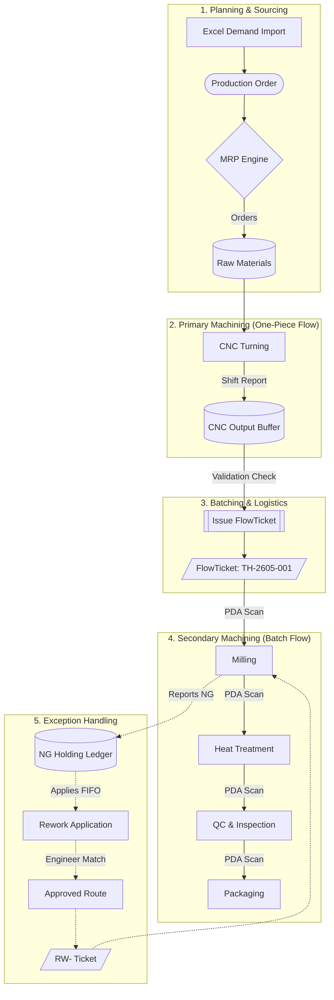
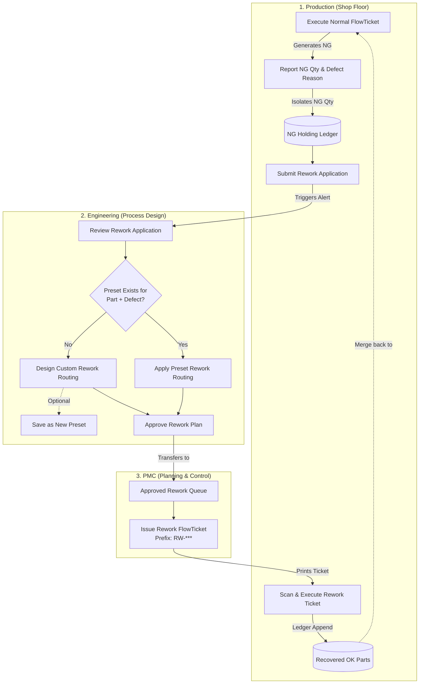

IPE Thailand Smart Factory OS: Comprehensive User Manual
========================================================

**Version:** 2.2

**Target Audience:** All IPE Thailand Staff (PMC, Engineering, Production, Management, Administration)

**System:** IPE Smart Factory OS (formerly MES)
Table of Contents

-----------------

1. [Chapter 1: The Master Workflow (Cross-Department Collaboration)](https://www.google.com/search?q=%23chapter-1-the-master-workflow-cross-department-collaboration "null")

2. [Chapter 2: Production Material Control (PMC) Guide](https://www.google.com/search?q=%23chapter-2-production-material-control-pmc-guide "null")

3. [Chapter 3: Engineering Guide](https://www.google.com/search?q=%23chapter-3-engineering-guide "null")

4. [Chapter 4: Shop Floor Operator Guide](https://www.google.com/search?q=%23chapter-4-shop-floor-operator-guide "null")

5. [Chapter 5: APS Scheduler & Algorithm Guide](https://www.google.com/search?q=%23chapter-5-aps-scheduler--algorithm-guide "null")

6. [Chapter 6: Executive & Management Guide](https://www.google.com/search?q=%23chapter-6-executive--management-guide "null")

7. [Chapter 7: System Administrator Guide](https://www.google.com/search?q=%23chapter-7-system-administrator-guide "null")

Chapter 1: The Master Workflow (Cross-Department Collaboration)
---------------------------------------------------------------

The IPE Smart Factory OS operates on a **Hybrid Production Flow**. Because CNC turning machines output parts continuously (One-Piece Flow), but downstream processes like Milling and Heat Treatment require grouped bins (Batch Flow), the system automatically bridges these two methods.

### 1.1 Visual Production Flow

### 1.2 Visual Rework Flow

Chapter 2: Production Material Control (PMC) Guide
--------------------------------------------------

As a PMC Planner, you act as the brain of the factory. You inject demand, order materials, and release batches to the floor.

### 2.1 Managing Production Orders (Demand)

Production Orders (POs) dictate what the primary CNC machines should produce.

* **Importing via Excel:** Click "Import Excel" and upload the Master Plan `.xlsx` file. The system automatically parses rows into `PENDING` orders.

* **Tracking Progress:** Watch the "CNC Output Progress" bar. It updates live as operators submit shift reports.

* **Table Navigation:** Use the search bar to find specific SAP References. For large lists of historical orders, use the **Pagination Controls** (Prev/Next/Page Numbers) located at the bottom right of the data table.

* **Viewing Details:** Click the arrow button on the right side of any order to open the **Slide-out Details Panel**. This shows you exactly which CNC machines contributed to the output and lists all FlowTickets generated from this order.

> 
> 
> 
> 
> 

### 2.2 Running the Grouped MRP Engine

* **The Logic:** The MRP engine groups **shared raw materials** across multiple different Production Orders to prevent over-purchasing.

* **Shared Inventory Deduction:** The system automatically subtracts Warehouse Stock, In-Transit POs, and Unused Shop Floor Stock before suggesting a "Net Amount to Buy".

> 

### 2.3 Issuing FlowTickets (Batching)

* **Buffer Validation (System Control):** When generating a new ticket, the system checks the **Unallocated CNC Buffer**. You **cannot** issue a ticket for 500 pieces if the turning machines have only produced 400 pieces. The system strictly blocks this.

> ![`[SCREENSHOT: TicketManagement.html showing the Ticket Generation Modal and Buffer Validation Error]`](file:///D:/Pictures/Typedown/0c608440-58cf-4ca2-b13d-043ccfa00426.png)
> 
> 

### 2.4 Issuing Rework Tickets (Exception Handling)

When defective parts (NG) are sent for rework, Engineering must first approve a recovery route. Once approved, the job is handed over to PMC to issue the physical traveler.

* **Action:** Open the **Rework Issuance (PMC)** module to view the "Engineering Approved Handoffs" queue.

* **Issuing the Ticket:** Click **Issue RW Ticket** next to the approved plan. The system will automatically generate a new ticket number with a distinct `RW-` prefix (e.g., `RW-2605-001`) so operators know it is a special recovery batch.

* **Print & Handover:** Print the generated ticket with the QR code and attach it to the physical bin of NG parts so the shop floor can begin the rework execution.

> 
> 
> 

### 2.5 Issuing Packaging Directives (Priority Control)

Sometimes, finished goods pile up at the packaging station while logistics is waiting for a specific urgent shipment. PMC can push an urgent alert to the packing team.

* **Action:** Open the **Packing Directives** module.

* **Review Unpacked WIP:** The left panel shows exactly what parts are sitting in bins at the packaging station, waiting to be boxed.

* **Issue Directive:** Click **Expedite** on a specific part, set the Priority Level (HIGH or CRITICAL), and specify the Target Quantity.

* **Result:** This broadcasts a direct, flashing alert to the operator's Packaging Terminal, overriding their normal flow and directing them to pack those specific parts immediately.

> 

Chapter 3: Engineering Guide
----------------------------

Process Engineers define the rules of production.

### 3.1 Routing Blueprints & ECN Control

* **Building a Route:** Use the drag-and-drop builder to set the machine sequence.

* **ECN Locking (System Control):** Once a Routing Version is marked `APPROVED`, it is permanently locked. To make changes, click **Create ECN** to clone it into a new `DRAFT` version.

> 
> 
> 
> 
> 

### 3.2 Rework Design & Smart Matching

* **Smart Match (System Control):** When operators submit defective parts, if the system detects that you have solved this exact Part + Defect combination before, it flashes an Emerald **"Preset Found"** alert. Click "Apply Preset" to instantly route it.

> 
> 
> 

Chapter 4: Shop Floor Operator Guide
------------------------------------

Operators use PDAs to communicate physical realities to the digital ledger.

### 4.1 Daily Production Tasks (The Operator Dashboard)

Before starting work, operators can view their personal dispatch list for the day.

* **Action:** Open the **Daily Operator Tasks** module and select your assigned machine from the dropdown (e.g., "CNC-01").

* **Features:** The responsive UI displays the currently active task with a live progress bar. If the machine is undergoing tooling changeovers, it shows an amber "Setup Mode" alert. The right side displays the upcoming queue.

* **Overview Mode:** Supervisors can select "All Machines" from the dropdown to see the live status of every machine stacked vertically, along with a unified timeline of the upcoming queue.

> 
> 
> 

### 4.2 CNC Shift Report (Primary Machining)

* **Action:** Because you cut from a continuous bar, you do not scan tickets. You select the Active Production Order and input your `OK`, `NG`, and `Scrap` totals at the end of the shift.

> 

### 4.3 PDA Batch Terminal (Secondary Machining)

* **Action:** Scan the QR code on the physical FlowTicket bin.

* **Strict Balance Equation (System Control):** The system enforces perfect accounting: `Previous OK Quantity MUST EQUAL (Current OK + Current NG + Current Scrap + Lost)`. If the numbers do not balance, the "Submit" button turns red and blocks data entry.

* **Partial Batch Rule (System Control):** By default, if the previous station is only halfway done with their batch, the system locks your sequence until the previous machine finishes.

> 

### 4.4 Requesting Rework

* **FIFO Deduction (System Control):** You simply scan the Part Number and enter the NG quantity. The backend automatically deducts the parts using FIFO (First-In, First-Out) logic from the oldest holding ledgers.

> 

### 4.5 Packaging Terminal

* **Strict Part Lock (System Control):** You **cannot** mix parts. If an open box has "Shaft A", scanning a ticket for "Gear B" triggers a red rejection error.

* **Force Sealing (System Control):** If a box is only partially full but needs to be shipped, you must explicitly click **Force Seal Partial Box** to lock it.

> 
> 
> 

Chapter 5: APS Scheduler & Algorithm Guide
------------------------------------------

The Advanced Planning and Scheduling (APS) module acts as the "AI Copilot" for the factory.

### 5.1 The Algorithm: Simulated Annealing & Hybrid Logic

The APS uses **Simulated Annealing** to minimize penalties (Late Deliveries, Setup Times, Idle Times). It looks at two data sources:

* **Primary Schedule (Push):** Schedules CNC machines based on Production Orders (Solid Indigo blocks).

* **Secondary Schedule (Pull):** Schedules Milling/Heat Treatment based on FlowTickets (Solid Blue blocks).

* **Predictive Linkage:** If a CNC machine is scheduled to finish cutting parts tomorrow, the APS automatically creates a **Predictive Ticket (Dashed Light Blue block)** and reserves time on the downstream Milling machine in advance.

### 5.2 AI Copilot Insights

* **Action:** Click the purple **AI Copilot** button.

* **Features:** The system scans 168 hours of data and alerts you to things like "High Setup Penalties" (suggesting order rearrangements) or predictive bottleneck warnings.

> 
> 
> 

### 5.3 Daily Dispatch Plan & Export

* **Action:** Click the **Daily Plan** button.

* **Features:** This tool flattens the complex Gantt chart into a paginated tabular list showing exactly what jobs run on what machines over the next 24 hours.

* **Export:** Click **Export CSV** to download the day's plan for supervisors.

> 

Chapter 6: Executive & Management Guide
---------------------------------------

### 6.1 Executive Dashboard

* **Factory OEE (Live):** Aggregates Availability, Performance, and Quality directly from the shop floor PDA scans in real-time.

* **WIP Bottleneck Radar:** Uses the active ledger to calculate exactly how many parts are sitting physically waiting at each work center.

* **First Pass Yield (FPY) Matrix:** Calculates the Rolled Throughput Yield automatically across multiple routing steps.

> 

Chapter 7: System Administrator Guide
-------------------------------------

### 7.1 User Management & Security

* **Access Control:** The system relies on strict field-level role security (e.g., ADMIN, PMC, ENGINEER, PRODUCTION).

* **Table Navigation:** Use the pagination footer to manage large employee rosters.

* **RFID Enrollment:** Open User Management, select a worker, and use a USB RFID reader to scan their physical badge. This saves the Hex Code so they can log into PDAs without passwords.

> 
> 
> 

_End of Document_

